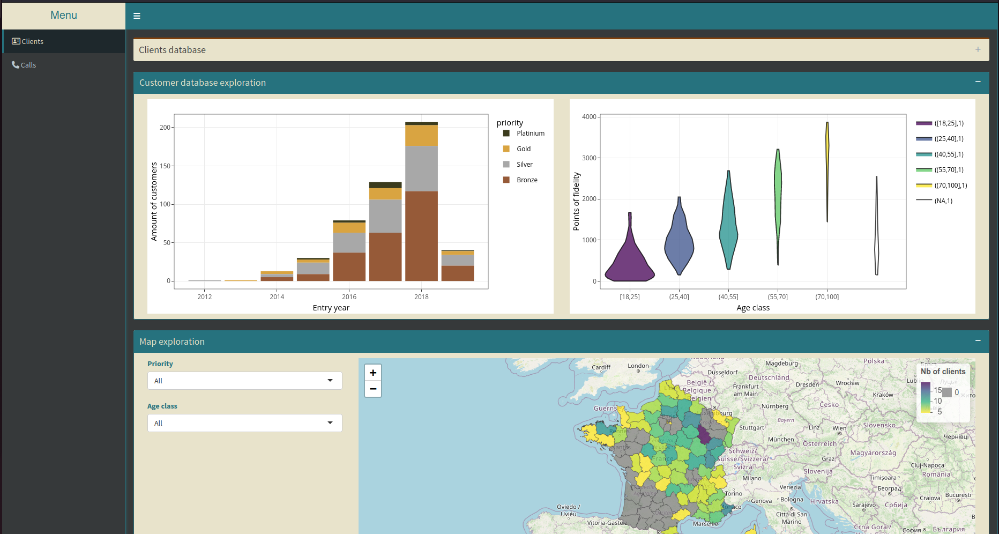

<!-- README.md is generated from README.Rmd. Please edit that file -->

```{r setup, include = FALSE}
knitr::opts_chunk$set(
  collapse = TRUE,
  comment = "#>",
  fig.path = "man/figures/README-",
  out.width = "100%"
)
```

<!-- badges: start -->
[](https://github.com/ThinkR-open/clientapp/actions/workflows/R-CMD-check.yaml)
[](https://www.tidyverse.org/lifecycle/#experimental)
<!-- badges: end -->


# clientapp

The goal of {clientapp} is to build a shiny app in a R package to explore a (fake) client database. Building a Shiny Application included in a R package is made easier with [{golem}](https://github.com/ThinkR-open/golem). Database was built using [{fakir}](https://github.com/ThinkR-open/fakir).

This app is deployed there: https://connect.thinkr.fr/clientapp/

```{r, echo=FALSE, out.width="80%"}

```


Please note that this project is released with a [Contributor Code of Conduct](CODE_OF_CONDUCT.md).
  By participating in this project you agree to abide by its terms.
